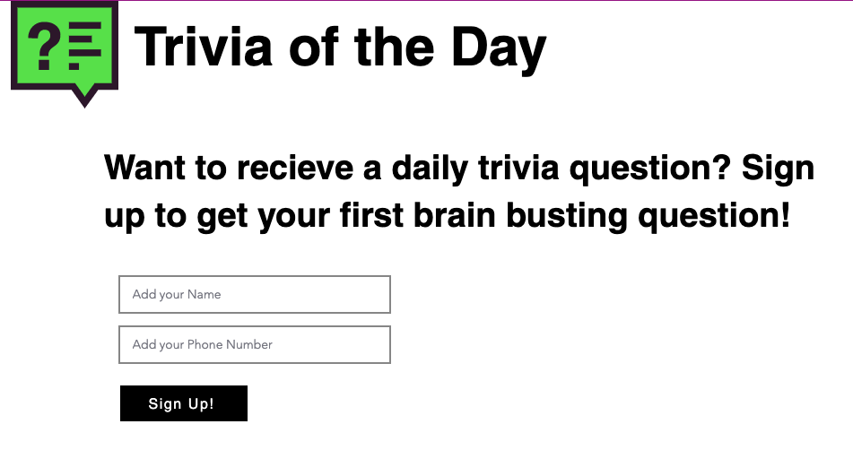

# Trivia of the Day Text Service Challenge

Did you know you can integrate 3rd party services and APIs into your Velo enabled Wix web application? This challenge is to create a texting service that sends users a Trivia Question of the Day using Twilio and Velo!

Velo opens up an entire JavaScript web development platform on top of Wix so you can customize your site without additional maintenance headaches or extra hosting costs. If you want to learn more about Velo, check out [our site](https://www.wix.com/Velo/).

**:link: Useful Links**

- [Velo API Reference](https://www.wix.com/velo/reference/) covers all of Velo's APIs.
- [Velo Home Page](https://www.wix.com/velo) contains all Velo materials.
- [Twilio SMS Docs](https://www.twilio.com/docs/sms)

## Getting Started

This workshop is based on a pre-designed [template](https://editor.wix.com/html/editor/web/renderer/new?siteId=fb3993d7-bbae-4c29-901a-fc98a9d2d3bf&metaSiteId=9f93bc1a-f23a-4e64-bffb-15bfab6aa0ab&autoDevMode=true) to get you started.

**:white_check_mark: Step-by-step instructions**

1. Go to this [template](https://editor.wix.com/html/editor/web/renderer/new?siteId=fb3993d7-bbae-4c29-901a-fc98a9d2d3bf&metaSiteId=9f93bc1a-f23a-4e64-bffb-15bfab6aa0ab&autoDevMode=true).
2. Click **Edit this site**.
3. Sign in to Wix.
4. Let's start having fun!

## Modules

This workshop is divided into modules. Each module describes what we're going to build and provides step-by-step instructions to help you implement the architecture and verify your work.

| Module    | Description       |
| -------------------------| ------------|
| [Getting Started](docs/GET_STARTED.md)   | Make sure you are set up to hit the ground running       |
| [Create the Sign Up](docs/SIGN_UP.md)   | Create an input for users to add their data     |
| [Create the Database](docs/DATABASE.md)   | Create a database to store your user's data     |
| [Get User Input Data](docs/GET_DATA.md)   | Get the usr's input values from the fields    |
| [Save the data in your Database](docs/SAVE_DATA.md)   | Save the user data into your database    |
| [Install the Twilio NPM Helper](docs/INSTALL_TWILIO.md)   | Access the npm package manager and install Twilio   |

## BONUS: Automated Responses

Are your users tired of receiving the mind bindingly difficult questions to answer? Let them unsubscribe by responding to your phone number.
